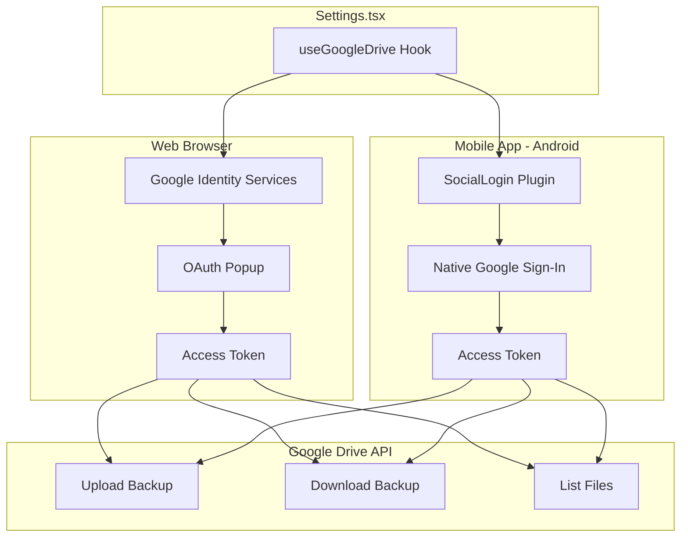

# Google Account Backup - Mobile App Implementation Plan

## ✅ Implementation Complete

Google Account Backup feature has been updated to work on both Web and Mobile (Android).

---

## Changes Made

### 1. Installed Plugin

```bash
npm install @capgo/capacitor-social-login
```

**Package**: `@capgo/capacitor-social-login@8.3.5`
- Supports Capacitor 8
- Provides native Google Sign-In for Android
- Also supports iOS, Facebook, Apple, Twitter login

### 2. Updated Files

| File | Changes |
|------|---------|
| [`package.json`](../package.json) | Added `@capgo/capacitor-social-login` dependency |
| [`android/app/src/main/AndroidManifest.xml`](../android/app/src/main/AndroidManifest.xml) | Added OAuth callback intent filter |
| [`utils/googleDrive.ts`](../utils/googleDrive.ts) | Hybrid implementation for web + mobile |

### 3. AndroidManifest.xml Changes

Added intent filter for OAuth callback:

```xml
<!-- Google OAuth Callback -->
<intent-filter>
    <action android:name="android.intent.action.VIEW" />
    <category android:name="android.intent.category.DEFAULT" />
    <category android:name="android.intent.category.BROWSABLE" />
    <data android:scheme="com.societyilada.manager" />
</intent-filter>
```

### 4. googleDrive.ts Changes

The hook now:
- Detects platform using `Capacitor.isNativePlatform()`
- Uses `SocialLogin` plugin for native mobile
- Uses Google Identity Services for web
- Provides consistent API for both platforms

---

## 🔧 Google Cloud Console Configuration Required

**You must configure Google Cloud Console for Android OAuth:**

### Step 1: Get SHA-1 Fingerprint

Run this command to get the SHA-1 fingerprint from your keystore:

```bash
keytool -list -v -keystore android/app/society-ilada-release.keystore -alias society-ilada
```

### Step 2: Add Android OAuth Client

1. Go to [Google Cloud Console](https://console.cloud.google.com/)
2. Select your project
3. Navigate to **APIs & Services > Credentials**
4. Click **Create Credentials > OAuth Client ID**
5. Select **Android** as application type
6. Add:
   - **Package name**: `com.societyilada.manager`
   - **SHA-1 fingerprint**: (from Step 1)

### Step 3: Verify Web OAuth Client

Ensure the Web OAuth Client is configured:
- **Client ID**: `17723786712-nt8kpbjv0rbi2u9v75r9ouq7eqconhd2.apps.googleusercontent.com`
- This is used for the `webClientId` in the plugin initialization

---

## Architecture



---

## Testing Checklist

Before releasing, test these scenarios:

### Web Testing
- [ ] Google Sign-In popup appears
- [ ] User can authenticate
- [ ] Backup to Drive works
- [ ] Restore from Drive works
- [ ] Logout works

### Android Testing
- [ ] Native Google Sign-In appears
- [ ] User can authenticate
- [ ] Backup to Drive works
- [ ] Restore from Drive works
- [ ] Logout works
- [ ] Token persists across app restarts

---

## Build Commands

```bash
# Build web assets
npm run build

# Sync with Android
npx cap sync android

# Open in Android Studio
npx cap open android

# Build APK from Android Studio
# Build > Build Bundle(s) / APK(s) > Build APK(s)
```

---

## Troubleshooting

### Error: "Google Sign-In failed"
- Verify SHA-1 fingerprint in Google Cloud Console
- Check package name matches exactly
- Ensure Google Drive API is enabled

### Error: "Access token is null"
- Check if user cancelled the sign-in
- Verify OAuth consent screen is configured
- Check logcat for detailed errors

### Error: "Drive API permission denied"
- Verify scopes are correct
- Check if Google Drive API is enabled in Cloud Console
- Ensure user granted Drive permissions

---

## Alternative: Firebase Cloud Sync

The app already has **Firebase Cloud Sync** which works perfectly on both platforms:

- Already implemented in [`services/firebase.ts`](../services/firebase.ts)
- Works seamlessly on mobile
- No additional configuration needed
- More reliable than Google Drive API

**Recommendation**: Firebase Cloud Sync is the recommended backup method. Google Drive backup is provided as a secondary option.
